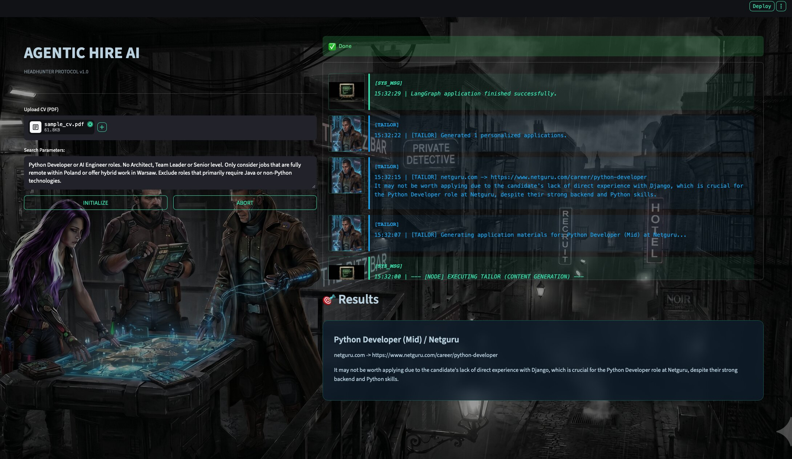

# 🧠 AgenticHire AI



An AI-powered agent system that autonomously searches, validates, evaluates, and tailors job applications using a multi-agent LangGraph architecture combined with RAG and Vision-based CV understanding.

---

## 🛠️ Tech Stack

The project leverages a modern and robust tech stack to deliver its AI-powered capabilities:

-   **Orchestration:** [LangGraph](https://langchain-ai.github.io/langgraph/) for building stateful, multi-agent applications.
-   **Programming Language:** Python
-   **AI/ML:**
    -   Large Language Models (LLMs) for reasoning, validation, and content generation (e.g., via [OpenRouter](https://openrouter.ai/), OpenAI, Anthropic).
    -   Vision LLMs for multimodal CV understanding.
    -   Retrieval-Augmented Generation (RAG) for semantic context.
-   **Vector Database:** [ChromaDB](https://www.chromadb.com/) for efficient storage and retrieval of embeddings.
-   **Web Framework:** [Streamlit](https://streamlit.io/) for the interactive user interface.
-   **Dependency Management:** [uv](https://github.com/astral-sh/uv) for fast and reliable package management.
-   **External Integrations:**
    -   [OrioSearch](https://www.oriosearch.org/) for job search APIs.
    -   Various web scraping and search engine APIs (e.g., Tavily, Google).

---

## 🔑 Key Features

### 🔎 Autonomous Job Discovery
The system uses a Scout Agent to search and scrape job postings from external sources using search and scraping tools.

---

### 🧹 Job Validation Layer
Every discovered job is validated before further processing:
- Checks if the job URL is reachable
- Detects expired or closed job postings using an LLM
- Limits number of valid jobs for efficiency

---

### 🔁 Controlled Agent Loop
A safe retry mechanism ensures the system does not loop infinitely:
- Tracks number of scout runs
- Re-runs search if not enough valid jobs are found
- Stops after reaching defined limits

---

### 🧠 Orchestrator (Matchmaker)
The Orchestrator evaluates job suitability using:
- CV context retrieval (RAG)
- LLM-based scoring (0.0 → 1.0)
- Shortlisting only strong matches

---

### 📚 RAG (Retrieval-Augmented Generation)
The system retrieves relevant CV knowledge before evaluating jobs:
- Matches job description with candidate experience
- Improves scoring accuracy using semantic context

---

### 👁️ Vision-Based CV Understanding (Multimodal Pipeline)

Instead of relying on broken PDF text extraction, the system uses a Vision LLM pipeline:

PDF → Images → Vision LLM → Clean Text → Chunking → Embeddings → ChromaDB

This allows:
- Accurate CV parsing from any PDF layout
- Better extraction of skills and experience
- Stronger semantic matching in RAG

---

### ✍️ Tailor Agent
Generates final application insights:
- Evaluates whether a job is worth applying to
- Uses orchestrator reasoning + CV context
- Produces a concise decision per job

---

### 🖥️ Interactive User Interface (Streamlit)
Provides a clean, intuitive web interface to:
- Input search parameters and candidate profiles easily
- Visualize the agentic workflow and decision-making process
- Review shortlisted jobs, RAG scores, and tailored application strategies

---

## 🏗️ Architecture Overview (ASCII)
```
╔════════════════════════════════════════════════════════════╗
║                       ENTRY POINT                          ║
╠════════════════════════════════════════════════════════════╣
║           ui.py (Streamlit UI)  &  main.py (CLI)           ║
╚═══════════════════════════════╦════════════════════════════╝
                                ║
                                ▼

╔════════════════════════════════════════════════════════════╗
║                   LANGGRAPH ORCHESTRATION                  ║
╠════════════════════════════════════════════════════════════╣

    ┌────────────────────────────┐
    │        SCOUT AGENT         │
    │ - Job search               │
    │ - Web scraping             │
    └─────────────┬──────────────┘
                  │
                  ▼

    ┌────────────────────────────┐
    │     VALIDATE JOBS NODE     │
    │ - URL health check         │
    │ - Expiration detection     │
    │ - Limit results            │
    └─────────────┬──────────────┘
                  │
                  ▼

    ┌────────────────────────────┐
    │   should_rescout()         │
    ├──────────────┬─────────────┤
    │ rescout      │ proceed     │ end
    ▼              ▼             ▼
 SCOUT     ┌──────────────┐     END
           │ ORCHESTRATOR │
           │ (MATCHMAKER) │
           └──────┬───────┘
                  │
                  ▼

    ┌────────────────────────────┐
    │        RAG LAYER           │
    │ - CV semantic retrieval    │
    └─────────────┬──────────────┘
                  │
                  ▼

    ┌────────────────────────────┐
    │       TAILOR AGENT         │
    │ - Final evaluation text    │
    └─────────────┬──────────────┘
                  ▼
                 END

╚════════════════════════════════════════════════════════════╝


╔════════════════════════════════════════════════════════════╗
║                         TOOLS LAYER                        ║
╠════════════════════════════════════════════════════════════╣
║ • job_search_tool                                          ║
║ • scrape_webpage_tool                                      ║
║ • job_validator (HTTP + LLM)                               ║
║ • vectordb (RAG retrieval)                                 ║
╚════════════════════════════════════════════════════════════╝


╔════════════════════════════════════════════════════════════╗
║                    EXTERNAL DEPENDENCIES                   ║
╠════════════════════════════════════════════════════════════╣
║ • Job Websites / APIs (OrioSearch)                         ║
║ • Vector Database (ChromaDB)                               ║
║ • Local Resume PDFs                                        ║
╚════════════════════════════════════════════════════════════╝
```

## ⚙️ Project Structure
The project follows a modular architecture designed for scalability and clear separation of concerns between the LangGraph orchestration and the individual AI Agents.
```
agentic-hire-ai/
├── data/                    # Local storage for source files (PDF resumes) and ChromaDB persistent data.
├── src/
│   ├── config/              # Logic for LangGraph nodes (The "Brains" of the system).
│   │   ├── settings.py      # Main application configuration file.
│   │   └── logging.py       # Logging configuration file.
│   ├── agents/              # Logic for LangGraph nodes (The "Brains" of the system).
│   │   ├── agents.py        # Core agent definitions and initialization.
│   │   ├── orchestrator.py  # Matchmaker logic, decision making, and task planning.
│   │   ├── scout.py         # Job fetching logic (Web Scraping / API integrations).
│   │   └── tailor.py        # Content generation for personalized applications.
│   ├── tools/               # Specialized utilities used by agents to interact with the world.
│   │   ├── job_validator.py # Tool for validating fetched job requirements.
│   │   ├── scrape.py        # Tool for scraping job descriptions from the web.
│   │   ├── search.py        # Search engine API wrappers (e.g., Tavily, Google).
│   │   └── vectordb.py      # Vector DB (RAG) integration for semantic resume matching.
│   ├── schema/              # Data models and shared state definitions.
│   │   └── state.py         # The TypedDict defining the LangGraph State.
│   ├── debug_db.py          # Utility for debugging and inspecting the database.
│   ├── graph.py             # The core LangGraph definition, node connections, and compilation.
│   └── utils.py             # Helper functions (PDF parsing, text formatting, logging).
├── .env                     # Environment variables and API keys (OpenAI, Anthropic, etc.).
├── ui.py                    # Main entry point for the interactive Streamlit UI.
└── main.py                  # Main entry point for the CLI application.
```

---

## Getting Started

This project uses [uv](https://github.com/astral-sh/uv) for blazing-fast Python dependency and environment management.

### 1. Install `uv`
If you do not have `uv` installed, you can install it globally via pip:
```bash
pip install uv
```
*(Alternatively, use the standalone installer from their official documentation).*

### 2. Sync the Environment
Once cloned, navigate to the project directory and run:
```bash
uv sync
```
This command will automatically create a virtual environment (`.venv`) and install all required dependencies listed in the `pyproject.toml` and `uv.lock` files.

### 3. Install `OrioSearch`
Check how-to: https://www.oriosearch.org

### 4. Create `.env` file
Create a .env file in the root directory of the project and store your configuration and API keys there:
```
OPENROUTER_API_KEY="YOUR_API_KEY"
ORIOSEARCH_BASE_URL="http://localhost:8000"
```

### 5. Customize Configuration (Optional)
All system constants (e.g., model names, limits, prompts) are centralized in `src/config.py`. You can override defaults via environment variables (prefixed with `AGENTIC_HIRE_`) or by editing the file directly. For example:
```
AGENTIC_HIRE_MAX_VALID_OFFERS=10
AGENTIC_HIRE_INITIAL_PROMPT="Your custom prompt here"
```


### 6. Run the Application
You can run AgenticHire AI using the interactive user interface or the command line:

Run the Streamlit UI:
```bash
uv run streamlit run ui.py
```

Run the CLI:
```bash
uv run python main.py
```

---

## 📄 License

This project is licensed under the MIT License - see the [LICENSE](LICENSE) file for details.

```
